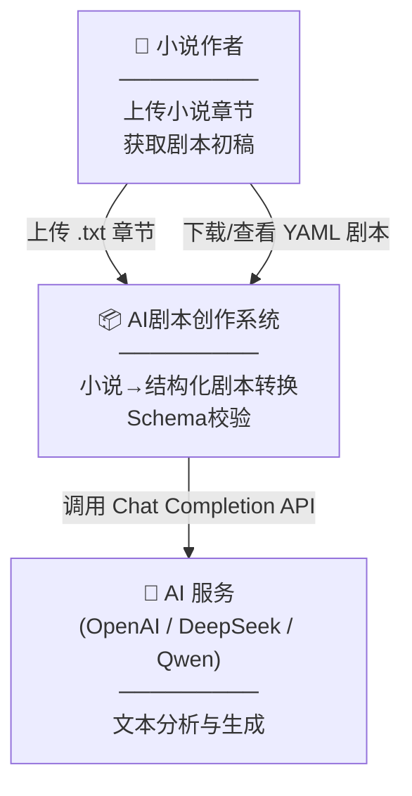
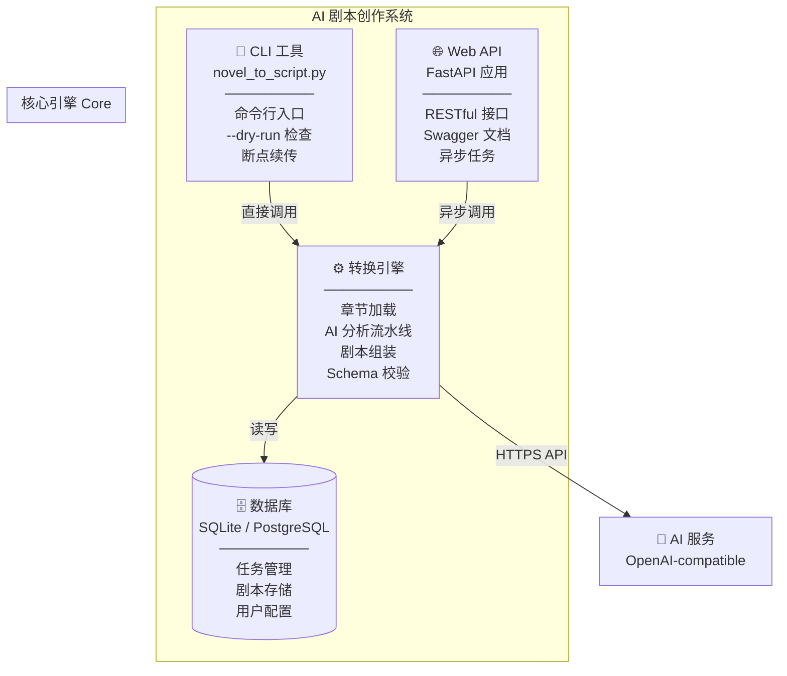
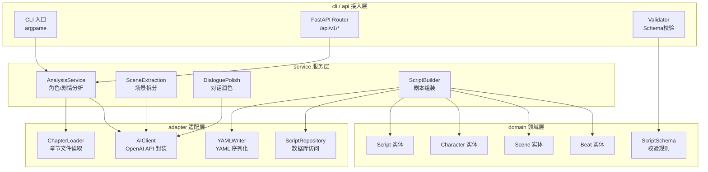
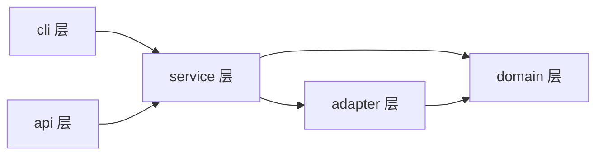
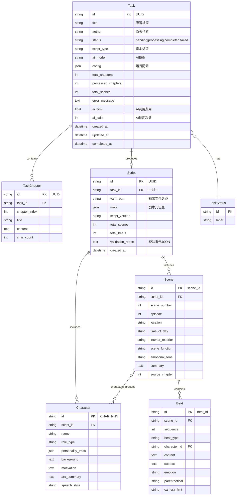
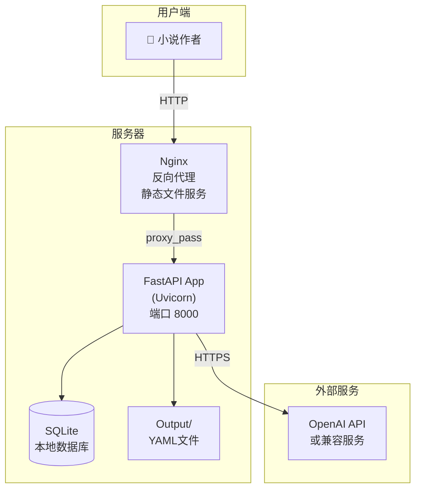

# AI 辅助剧本创作工具 — 架构设计文档

> 版本：1.0 | 日期：2026-06-05 | 架构师：AI Solution Architect

---

## 1. 架构设计概述

### 1.1 系统范围与目标

本系统面向小说作者，将 3 章以上的小说文本自动转换为符合行业规范的结构化剧本（YAML 格式），降低改编门槛，让作者快速获得可编辑、可打磨的剧本初稿。

**核心能力**：
- 批量小说章节加载与解析
- 基于 AI 的多阶段文本分析（角色提取、场景拆分、对话润色）
- 符合预定义 Schema 的结构化剧本输出
- 输出质量自动校验

### 1.2 关键约束

| 约束类型 | 内容 |
|----------|------|
| **业务约束** | 最少 3 章输入；输出必须符合 YAML Schema |
| **技术约束** | 依赖 OpenAI 兼容 API；Python 技术栈 |
| **运维约束** | 支持本地 CLI 运行 + Web API 部署；断点续传 |
| **成本约束** | AI API 调用是主要成本，需控制 token 消耗 |

---

## 2. 技术选型与架构决策记录 (ADR)

### ADR-001: 编程语言 — Python 3.11+

- **决策**: Python 3.11+
- **备选**: TypeScript (Node.js), Go
- **对比**:

| 维度 | Python | TypeScript | Go |
|------|--------|------------|-----|
| AI/LLM 生态 | 优秀（openai, langchain） | 中等 | 较弱 |
| 文本处理 | 优秀 | 良好 | 良好 |
| 团队熟悉度 | 高 | 中 | 低 |
| 部署复杂度 | 中等 | 中等 | 低（单二进制） |
| 并发模型 | asyncio | 原生 async | goroutine |

- **决策理由**: Python 拥有最成熟的 LLM SDK 生态（openai、tiktoken 等），且团队已熟悉 Python。团队不熟悉 Go，选择 Go 的风险高于收益。
- **取舍**: Python 在并发性能上不如 Go，但通过异步框架 FastAPI 可满足预期负载。

### ADR-002: Web 框架 — FastAPI

- **决策**: FastAPI
- **备选**: Flask, Django REST Framework
- **对比**:

| 维度 | FastAPI | Flask | Django REST |
|------|---------|-------|-------------|
| 异步支持 | 原生 asyncio | 需扩展 | 需扩展 |
| 自动 API 文档 | 内建 Swagger/ReDoc | 需插件 | 需插件 |
| 类型校验 | Pydantic 原生 | 需手动 | Serializer |
| 学习曲线 | 低 | 极低 | 中高 |
| 生态成熟度 | 高 | 极高 | 极高 |

- **决策理由**: FastAPI 原生异步支持对 LLM API 调用至关重要（避免阻塞），自动生成的 OpenAPI 文档可直接作为 API 契约交付。
- **取舍**: FastAPI 生态不如 Flask 丰富，但对于 API 服务场景已足够。

### ADR-003: 数据库 — SQLite（开发） / PostgreSQL（生产）

- **决策**: SQLite 作为默认嵌入式数据库，支持迁移到 PostgreSQL
- **备选**: 纯文件存储, MongoDB
- **对比**:

| 维度 | SQLite | PostgreSQL | MongoDB | 文件存储 |
|------|--------|------------|---------|----------|
| 部署复杂度 | 零配置 | 需独立服务 | 需独立服务 | 零配置 |
| 查询能力 | SQL | SQL 完整 | 文档查询 | 无 |
| 剧本结构化存储 | 适合 | 适合 | 适合 | YAML 文件 |
| 迁移成本 | 低→Pg 兼容 | — | 高 | 无 |

- **决策理由**: SQLite 零配置满足本地使用场景，且 SQL 语法与 PostgreSQL 高度兼容，便于日后迁移。纯文件存储无法支持任务追踪、用户管理等扩展需求。
- **取舍**: SQLite 不支持高并发写入，仅适用于单用户或低并发场景。

### ADR-004: 分层架构 — 领域驱动精简版

- **决策**: 采用 domain / service / adapter / cli 四层架构
- **备选**: MVC, 单体脚本
- **对比**:

| 维度 | 分层架构 | MVC | 单体脚本 |
|------|---------|-----|----------|
| 可测试性 | 高（层间 mock） | 中 | 低 |
| 可维护性 | 高 | 中 | 低 |
| 开发效率 | 中 | 高 | 极高 |
| 扩展性 | 高 | 中 | 低 |

- **决策理由**: 分层架构在「当前复杂度」与「未来扩展」间取得平衡，不像微服务那样过度设计，也不像单体脚本难以维护。
- **取舍**: 初期开发效率略低于单体脚本，但在项目超过 500 行时收益迅速显现。

### ADR-005: YAML Schema 校验策略 — 后置校验 + 重试

- **决策**: 生成完成后执行 Schema 校验，发现错误记录但不阻塞输出
- **备选**: 前置校验（prompt 约束）, 无校验
- **决策理由**: AI 输出无法 100% 保证格式，后置校验可捕获异常并给出明确修复指引。前置校验（仅靠 prompt）漏检率高。
- **取舍**: 后置校验无法防止 AI token 浪费，但比复杂的 prompt 工程更可靠。

---

## 3. 系统架构图 (C4 模型)

### 3.1 Level 1: 上下文图 (Context)



### 3.2 Level 2: 容器图 (Container)



### 3.3 Level 3: 组件图 (Component)



---

## 4. 模块划分与边界定义

| 模块名称 | 核心职责 | 对外暴露接口 | 禁止依赖 | 允许依赖 |
|----------|----------|--------------|----------|----------|
| **domain** | 实体定义、枚举常量、Schema 校验规则 | Script, Character, Scene, Beat, ScriptSchema | 任何外部模块 | 仅标准库 |
| **service** | 业务逻辑编排：分析、提取、润色、组装 | AnalysisService, SceneExtractionService, ScriptBuilder | domain（禁止反向依赖） | domain, adapter |
| **adapter** | 外部交互：文件IO、AI API、数据库、YAML | ChapterLoader, AIClient, YAMLWriter, ScriptRepository | service（禁止反向依赖） | domain |
| **cli** | 命令行入口 | main() | 无 | service, adapter, domain |
| **api** | RESTful API 接口 | FastAPI Router, Pydantic Schemas | 无 | service, domain |

### 模块依赖图



### 架构原则

1. **依赖方向**: cli/api → service → adapter/domain。禁止反向依赖
2. **无循环依赖**: 通过 domain 层打破循环（adapter 仅依赖 domain，不依赖 service）
3. **无穿透调用**: cli/api 不得直接访问 adapter；service 不得直接操作文件系统
4. **接口隔离**: 每个 adapter 仅暴露其职责相关的方法

---

## 5. API 契约设计

### 5.1 转换任务 API

```yaml
openapi: 3.0.0
info:
  title: AI 剧本创作工具 API
  version: 1.0.0
  description: 小说文本转结构化剧本的 RESTful API

servers:
  - url: http://localhost:8000/api/v1
    description: 本地开发服务器

paths:
  /convert:
    post:
      summary: 提交小说文本，异步启动转换任务
      tags: [Conversion]
      requestBody:
        required: true
        content:
          application/json:
            schema:
              $ref: '#/components/schemas/ConvertRequest'
      responses:
        '202':
          description: 任务已接受
          content:
            application/json:
              schema:
                $ref: '#/components/schemas/TaskResponse'
        '400':
          description: 请求参数错误
          content:
            application/json:
              schema:
                $ref: '#/components/schemas/ErrorResponse'
        '422':
          description: 章节不足 3 章或格式不符合
          content:
            application/json:
              schema:
                $ref: '#/components/schemas/ErrorResponse'

  /convert/upload:
    post:
      summary: 上传小说章节文件（multipart），自动启动转换
      tags: [Conversion]
      requestBody:
        required: true
        content:
          multipart/form-data:
            schema:
              type: object
              properties:
                files:
                  type: array
                  items:
                    type: string
                    format: binary
                  description: 章节 .txt 文件（至少3个）
                title:
                  type: string
                  description: 原著标题
                author:
                  type: string
                  description: 原著作者
      responses:
        '202':
          description: 任务已接受
          content:
            application/json:
              schema:
                $ref: '#/components/schemas/TaskResponse'
        '422':
          description: 文件数量不足或格式错误

  /tasks/{task_id}:
    get:
      summary: 查询任务状态
      tags: [Tasks]
      parameters:
        - name: task_id
          in: path
          required: true
          schema:
            type: string
            format: uuid
      responses:
        '200':
          description: 任务状态
          content:
            application/json:
              schema:
                $ref: '#/components/schemas/TaskStatusResponse'
        '404':
          description: 任务不存在

  /tasks/{task_id}/script:
    get:
      summary: 下载生成的剧本 YAML
      tags: [Tasks]
      parameters:
        - name: task_id
          in: path
          required: true
          schema:
            type: string
            format: uuid
      responses:
        '200':
          description: 剧本 YAML 内容
          content:
            text/yaml:
              schema:
                type: string
        '404':
          description: 任务不存在或未完成
        '409':
          description: 任务尚未完成，无法下载

  /tasks/{task_id}/validate:
    post:
      summary: 对指定任务的剧本执行 Schema 校验
      tags: [Tasks]
      parameters:
        - name: task_id
          in: path
          required: true
          schema:
            type: string
            format: uuid
      responses:
        '200':
          description: 校验结果
          content:
            application/json:
              schema:
                $ref: '#/components/schemas/ValidationReport'

  /tasks:
    get:
      summary: 列出所有任务（支持分页和筛选）
      tags: [Tasks]
      parameters:
        - name: status
          in: query
          schema:
            type: string
            enum: [pending, processing, completed, failed]
        - name: page
          in: query
          schema:
            type: integer
            default: 1
        - name: page_size
          in: query
          schema:
            type: integer
            default: 20
      responses:
        '200':
          description: 分页任务列表
          content:
            application/json:
              schema:
                $ref: '#/components/schemas/TaskListResponse'

components:
  schemas:
    ConvertRequest:
      type: object
      required: [chapters]
      properties:
        chapters:
          type: array
          items:
            type: object
            properties:
              title:
                type: string
                description: 章节标题
              content:
                type: string
                description: 章节正文
          minItems: 3
          description: 至少 3 个章节
        title:
          type: string
          description: 原著小说标题
        author:
          type: string
          description: 原著作者
        config:
          type: object
          properties:
            model:
              type: string
              description: AI 模型名称
            temperature:
              type: number
              minimum: 0
              maximum: 1
            script_type:
              type: string
              enum: [film, tv_series, short_drama, stage_play]

    TaskResponse:
      type: object
      properties:
        task_id:
          type: string
          format: uuid
        status:
          type: string
          enum: [pending]
        created_at:
          type: string
          format: date-time
        estimated_duration:
          type: string
          description: 预估完成时间

    TaskStatusResponse:
      type: object
      properties:
        task_id:
          type: string
          format: uuid
        status:
          type: string
          enum: [pending, processing, completed, failed]
        progress:
          type: object
          properties:
            current_step:
              type: string
              description: 当前处理步骤
            total_chapters:
              type: integer
            processed_chapters:
              type: integer
            total_scenes:
              type: integer
        script_available:
          type: boolean
          description: 剧本是否可下载
        created_at:
          type: string
          format: date-time
        completed_at:
          type: string
          format: date-time
        error_message:
          type: string
          description: 失败原因（status=failed时）

    TaskListResponse:
      type: object
      properties:
        items:
          type: array
          items:
            $ref: '#/components/schemas/TaskStatusResponse'
        total:
          type: integer
        page:
          type: integer
        page_size:
          type: integer

    ValidationReport:
      type: object
      properties:
        task_id:
          type: string
          format: uuid
        valid:
          type: boolean
        errors:
          type: array
          items:
            type: string
        warnings:
          type: array
          items:
            type: string
        error_count:
          type: integer
        warning_count:
          type: integer

    ErrorResponse:
      type: object
      properties:
        error:
          type: string
          description: 错误类型
        message:
          type: string
          description: 错误详情
        code:
          type: integer
          description: HTTP 状态码
```

### 5.2 错误码统一说明

| HTTP 状态码 | 错误类型 | 说明 |
|-------------|----------|------|
| 400 | `bad_request` | 请求参数格式错误 |
| 404 | `not_found` | 任务或资源不存在 |
| 409 | `conflict` | 任务状态冲突（如未完成却请求下载） |
| 413 | `payload_too_large` | 章节总字数超出限制（默认 50 万字） |
| 422 | `validation_error` | 业务校验不通过（如不足 3 章） |
| 429 | `rate_limited` | AI API 调用频率超限 |
| 500 | `internal_error` | 服务内部错误 |
| 502 | `ai_service_error` | AI API 返回异常 |
| 503 | `service_unavailable` | 服务暂时不可用 |

---

## 6. 数据库设计

### 6.1 ER 图



### 6.2 表结构设计

#### task（转换任务表）

| 列名 | 类型 | 约束 | 说明 |
|------|------|------|------|
| id | TEXT | PK, UUID | 任务唯一标识 |
| title | TEXT | NOT NULL | 原著标题 |
| author | TEXT | | 原著作者 |
| status | TEXT | NOT NULL, DEFAULT 'pending' | pending/processing/completed/failed |
| script_type | TEXT | NOT NULL, DEFAULT 'tv_series' | 剧本类型 |
| ai_model | TEXT | NOT NULL | 使用的 AI 模型 |
| config | TEXT | | JSON 格式运行配置 |
| total_chapters | INTEGER | DEFAULT 0 | 总章节数 |
| processed_chapters | INTEGER | DEFAULT 0 | 已处理章节数 |
| total_scenes | INTEGER | DEFAULT 0 | 已提取场景数 |
| error_message | TEXT | | 失败原因 |
| ai_cost | REAL | DEFAULT 0.0 | AI API 估算费用 |
| ai_calls | INTEGER | DEFAULT 0 | AI API 调用次数 |
| created_at | TEXT | NOT NULL | ISO 8601 |
| updated_at | TEXT | NOT NULL | ISO 8601 |
| completed_at | TEXT | | ISO 8601 |

**索引**:
- PRIMARY KEY: `id`
- INDEX `idx_task_status` ON (`status`) — 查询待处理和进行中的任务
- INDEX `idx_task_created` ON (`created_at`) — 按创建时间排序

#### task_chapter（任务章节关联表）

| 列名 | 类型 | 约束 | 说明 |
|------|------|------|------|
| id | TEXT | PK, UUID | 记录唯一标识 |
| task_id | TEXT | FK → task.id, NOT NULL | 所属任务 |
| chapter_index | INTEGER | NOT NULL | 章节序号（从1开始） |
| title | TEXT | NOT NULL | 章节标题 |
| content | TEXT | NOT NULL | 章节正文 |
| char_count | INTEGER | DEFAULT 0 | 字符数 |

**索引**:
- PRIMARY KEY: `id`
- INDEX `idx_tc_task` ON (`task_id`, `chapter_index`) — 按任务查询章节
- UNIQUE `uq_tc_task_chapter` ON (`task_id`, `chapter_index`) — 防止重复章节

#### script（剧本产出表）

| 列名 | 类型 | 约束 | 说明 |
|------|------|------|------|
| id | TEXT | PK, UUID | 剧本唯一标识 |
| task_id | TEXT | FK → task.id, UNIQUE, NOT NULL | 一对一关联任务 |
| yaml_path | TEXT | | 输出 YAML 文件路径 |
| meta | TEXT | | JSON 格式剧本元信息 |
| script_version | TEXT | DEFAULT '0.1.0' | 剧本版本 |
| total_scenes | INTEGER | DEFAULT 0 | 场景总数 |
| total_beats | INTEGER | DEFAULT 0 | 节拍总数 |
| validation_report | TEXT | | JSON 格式校验报告 |
| created_at | TEXT | NOT NULL | ISO 8601 |

**索引**:
- PRIMARY KEY: `id`
- UNIQUE INDEX `uq_script_task` ON (`task_id`)

#### scene（场景表）

| 列名 | 类型 | 约束 | 说明 |
|------|------|------|------|
| id | TEXT | PK | 场景唯一标识 ("scene_{id}") |
| script_id | TEXT | FK → script.id, NOT NULL | 所属剧本 |
| scene_number | INTEGER | NOT NULL | 场景序号 |
| episode | INTEGER | DEFAULT 1 | 所属集数 |
| location | TEXT | NOT NULL | 地点 |
| time_of_day | TEXT | NOT NULL | 日/夜/傍晚/清晨/凌晨 |
| interior_exterior | TEXT | NOT NULL | 内/外 |
| scene_function | TEXT | | 场景功能 |
| emotional_tone | TEXT | | 情感基调 |
| summary | TEXT | | 场景概要 |
| source_chapter | INTEGER | | 对应原著章节 |

**索引**:
- PRIMARY KEY: `id`
- INDEX `idx_scene_script` ON (`script_id`, `scene_number`)

#### beat（节拍表）

| 列名 | 类型 | 约束 | 说明 |
|------|------|------|------|
| id | TEXT | PK | 节拍唯一标识 ("S{scene}_B{seq}") |
| scene_id | TEXT | FK → scene.id, NOT NULL | 所属场景 |
| sequence | INTEGER | NOT NULL | 节拍序号 |
| beat_type | TEXT | NOT NULL | dialogue/action/description/voiceover/monologue/transition |
| character_id | TEXT | | 执行角色 |
| content | TEXT | NOT NULL | 节拍内容 |
| subtext | TEXT | | 潜台词 |
| emotion | TEXT | | 情绪标注 |
| parenthetical | TEXT | | 表演提示 |
| camera_hint | TEXT | | 镜头提示 |

**索引**:
- PRIMARY KEY: `id`
- INDEX `idx_beat_scene` ON (`scene_id`, `sequence`)

### 6.3 索引策略

| 索引 | 对应查询模式 | 理由 |
|------|-------------|------|
| `idx_task_status` | `WHERE status = 'processing'` | 查询进行中的任务（轮询状态） |
| `idx_task_created` | `ORDER BY created_at DESC` | 任务列表按时间倒序 |
| `idx_tc_task` | `WHERE task_id = ? ORDER BY chapter_index` | 按任务加载所有章节 |
| `idx_scene_script` | `WHERE script_id = ? ORDER BY scene_number` | 按剧本加载场景 |
| `idx_beat_scene` | `WHERE scene_id = ? ORDER BY sequence` | 按场景加载节拍 |

### 6.4 分库分表策略

当前阶段不做分库分表。单用户场景下 SQLite 足够；迁移到 PostgreSQL 后，当数据量超过 **100 万条 beat 记录** 时，按 `script_id` 哈希分 4 表。

### 6.5 数据一致性

- task ↔ script: 一对一关系，事务保证原子性
- script ↔ scene: 一对多，script 删除时级联删除 scenes
- scene ↔ beat: 一对多，scene 删除时级联删除 beats
- AI 调用失败时的回滚：checkpoint 机制保证断点续传，不丢失已完成阶段

---

## 7. 非功能性需求设计

| 维度 | 指标要求 | 设计方案 |
|------|----------|----------|
| **性能** | 4 章（~5000 字）转换 ≤ 60s；QPS ≤ 5 | 异步任务队列；AI 调用间隔控制（1s）；多章并行分析（受 API rate limit 约束） |
| **可用性** | SLA 99%（Web 服务）；支持断点续传 | 每阶段自动保存 checkpoint；异常重试 3 次（指数退避） |
| **安全性** | API Key 保护；输入校验；SQL 注入防护 | API Key 仅环境变量/配置文件读取；Pydantic 校验所有输入；SQLAlchemy ORM 防注入 |
| **可扩展性** | 支持切换 AI 模型；支持自定义 Schema | OpenAI 兼容 API 抽象；Schema 规则可配置 |
| **可维护性** | 代码覆盖率 ≥ 80%；分层架构 | 18 项单元测试 + 集成测试；domain/service/adapter 三层分离 |
| **成本控制** | 单次转换 AI token 消耗可控 | 上下文窗口截断（每章前 1500 字 + 后 500 字）；缓存全局分析结果 |

---

## 8. 部署架构



### 基础设施需求

| 资源 | 最低配置 | 推荐配置 |
|------|---------|----------|
| CPU | 2 核 | 4 核 |
| 内存 | 2 GB | 4 GB |
| 存储 | 10 GB | 50 GB SSD |
| 网络 | 出站 HTTPS | 稳定的外网连接 |

### Docker 部署

```dockerfile
FROM python:3.11-slim
WORKDIR /app
COPY requirements.txt .
RUN pip install --no-cache-dir -r requirements.txt
COPY . .
EXPOSE 8000
CMD ["uvicorn", "api.main:app", "--host", "0.0.0.0", "--port", "8000"]
```

---

## 9. 风险与依赖

### 9.1 技术风险

| 风险 | 概率 | 影响 | 缓解措施 |
|------|------|------|----------|
| AI API 不稳定/限流 | 中 | 高 | 断点续传 + 指数退避重试 + 多 API 提供商切换 |
| AI 输出格式不符合 Schema | 高 | 中 | prompt 工程优化 + 后置 Schema 校验 + JSON 提取容错 |
| 大章节 token 超限 | 中 | 中 | 上下文截断策略（首尾采样）+ 分段分析 |
| 模型成本过高 | 中 | 中 | 缓存 + 本地微调小模型 + 按需选择模型级别 |

### 9.2 外部依赖

| 依赖 | 说明 | 降级方案 |
|------|------|----------|
| OpenAI API / 兼容服务 | 核心文本分析能力 | 支持 DeepSeek/Qwen 等多提供商 |
| Python 运行时 3.11+ | 代码执行环境 | Docker 标准化环境 |

### 9.3 遗留系统集成

当前为全新系统，无遗留系统集成需求。未来可能需要对接：
- 剧本编辑工具（导出 Final Draft .fdx 格式）
- 版本控制系统（Git 集成）
- 协作平台（多人评论标注）
